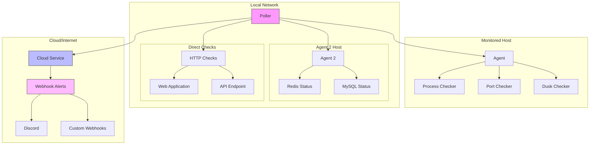

# ServiceRadar

[](https://github.com/mfreeman451/serviceradar/actions/workflows/release.yml)
[](https://github.com/mfreeman451/serviceradar/actions/workflows/golangci-lint.yml)
[](https://github.com/mfreeman451/serviceradar/actions/workflows/tests.yml)
[](https://github.com/mfreeman451/serviceradar/actions/workflows/go-coverage.yml)
<a href="https://cla-assistant.io/mfreeman451/serviceradar"></a>

ServiceRadar is a distributed network monitoring system designed for infrastructure and services in hard to reach places or constrained environments. 
It provides real-time monitoring of internal services, with cloud-based alerting capabilities to ensure you stay informed even during network or power outages.

### Screenshots

**Dashboard**:


**Node List**:


**SNMP Poller**:


**ICMP Test**:


**Network Scan**:


### Monitoring a Dusk Node


https://docs.dusk.network/operator/overview/

### Installation

ServiceRadar can be installed via direct downloads from GitHub releases.

#### Standard Setup (Recommended)
Install these components on your monitored host:
```bash
# Download and install core components
curl -LO https://github.com/mfreeman451/serviceradar/releases/download/1.0.19/serviceradar-agent_1.0.19.deb \
     -O https://github.com/mfreeman451/serviceradar/releases/download/1.0.19/serviceradar-poller_1.0.19.deb

sudo dpkg -i serviceradar-agent_1.0.19.deb serviceradar-poller_1.0.19.deb
```

On a separate machine (recommended) or the same host:
```bash
# Download and install cloud service
curl -LO https://github.com/mfreeman451/serviceradar/releases/download/1.0.19/serviceradar-cloud_1.0.19.deb
sudo dpkg -i serviceradar-cloud_1.0.19.deb
```

#### Optional: SNMP Polling
Download and install the SNMP checker to collect and visualize metrics:
```bash
curl -LO https://github.com/mfreeman451/serviceradar/releases/download/1.0.19/serviceradar-snmp-checker_1.0.19.deb
sudo dpkg -i serviceradar-snmp-checker_1.0.19.deb
```

#### Optional: Dusk Node Monitoring
If you're running a [Dusk](https://dusk.network/) node and want specialized monitoring:
```bash
curl -LO https://github.com/mfreeman451/serviceradar/releases/download/1.0.19/serviceradar-dusk-checker_1.0.19.deb
sudo dpkg -i serviceradar-dusk-checker_1.0.19.deb
```

#### Distributed Setup
For larger deployments where components run on different hosts:

1. On monitored hosts:
```bash
curl -LO https://github.com/mfreeman451/serviceradar/releases/download/1.0.19/serviceradar-agent_1.0.19.deb
sudo dpkg -i serviceradar-agent_1.0.19.deb
```

2. On monitoring host:
```bash
curl -LO https://github.com/mfreeman451/serviceradar/releases/download/1.0.19/serviceradar-poller_1.0.19.deb
sudo dpkg -i serviceradar-poller_1.0.19.deb
```

3. On cloud host:
```bash
curl -LO https://github.com/mfreeman451/serviceradar/releases/download/1.0.19/serviceradar-cloud_1.0.19.deb
sudo dpkg -i serviceradar-cloud_1.0.19.deb
```

## Security

[mTLS Setup](tls/README.md)

## Architecture

ServiceRadar uses a distributed architecture with three main components:



### Components

1. **Agent** (runs on monitored hosts)
  - Provides service status through gRPC
  - Supports multiple checker types:
    - Process checker (systemd services)
    - Port checker (TCP ports)
    - Custom checkers (e.g., Dusk node)
  - Must run on each host you want to monitor

2. **Poller** (runs anywhere in your network)
  - Coordinates monitoring activities
  - Can run on the same host as an agent or separately
  - Polls agents at configurable intervals
  - Reports status to cloud service
  - Multiple pollers can report to the same cloud service

3. **Cloud Service** (runs on a reliable host)
  - Receives reports from pollers
  - Provides web dashboard
  - Sends alerts via webhooks (Discord, etc.)
  - Should run on a reliable host outside your network

## Installation

ServiceRadar components are distributed as Debian packages. Each component has its own package:

### Building Packages

1. Clone the repository:
```bash
git clone https://github.com/mfreeman451/serviceradar.git
cd serviceradar
```

2. Build the agent package:
```bash
./scripts/setup-deb-agent.sh
```

3. Build the poller package:
```bash
./scripts/setup-deb-poller.sh
```

4. Build the cloud package:
```bash
./scripts/setup-deb-cloud.sh
```

5. Build the dusk provisioner node package (optional):
```bash
./scripts/setup-deb-dusk-checker.sh
```

6. Build the SNMP checker (optional):
```bash
./scripts/setup-deb-snmp-checker.sh
```

### Installation Order and Location

1. **Agent Installation** (on monitored hosts):
```bash
sudo dpkg -i serviceradar-dusk-checker_1.0.19.deb  # For Dusk nodes
# or
sudo dpkg -i serviceradar-agent_1.0.19.deb  # For other hosts
```

2. **Poller Installation** (on any host in your network):
```bash
sudo dpkg -i serviceradar-poller_1.0.19.deb
```

3. **Cloud Installation** (on a reliable host):
```bash
sudo dpkg -i serviceradar-cloud_1.0.19.deb
```

4. **SNMP Poller** (Optional):
```bash
sudo dpkg -i serviceradar-snmp-checker_1.0.19.deb
```

## Configuration

### Agent Configuration

Default location: ***/etc/serviceradar/***

**/etc/serviceradar/agent.json**

```json
{
  "checkers_dir": "/etc/serviceradar/checkers",
  "listen_addr": ":50051",
  "service_type": "grpc",
  "service_name": "AgentService",
  "security": {
    "mode": "none",
    "cert_dir": "/etc/serviceradar/certs",
    "server_name": "changeme",
    "role": "agent"
  }
}
```

For mTLS security:

* Set `mode` to `mtls`
* Set `server_name` to the hostname/IP address of the poller (IMPORTANT, this should line up with whats in your tls/csr.json)
* Set `listen_addr` to the hostname/IP address

#### SNMP Polling

**/etc/serviceradar/checkers/snmp.json**

```json
{
  "node_address": "localhost:50051",
  "listen_addr": ":50054",
  "security": {
    "server_name": "changeme",
    "mode": "none",
    "role": "checker",
    "cert_dir": "/etc/serviceradar/certs"
  },
  "timeout": "30s",
  "targets": [
    {
      "name": "test-router",
      "host": "192.168.1.1",
      "port": 161,
      "community": "public",
      "version": "v2c",
      "interval": "30s",
      "retries": 2,
      "oids": [
        {
          "oid": ".1.3.6.1.2.1.2.2.1.10.4",
          "name": "ifInOctets_4",
          "type": "counter",
          "scale": 1.0
        }
      ]
    }
  ]
}
```

For mTLS Security:

* Change `mode` to `mtls`
* Change `server_name` to the hostname/IP address of the agent, eg. `192.168.2.22:50054`
* Change `listen_addr` to the hostname/IP address, eg. `192.168.2.22:50054`

For Dusk nodes:

**/etc/serviceradar/checkers/dusk.json**

```json
{
  "name": "dusk",
  "type": "grpc",
  "node_address": "localhost:8080",
  "address": "localhost:50052",
  "listen_addr": ":50052",
  "timeout": "5m",
  "security": {
    "mode": "none",
    "cert_dir": "/etc/serviceradar/certs",
    "role": "checker"
  }
}
```

For mTLS Security:

* Change `mode` to `mtls`
* Change `address` to the hostname/IP address of the Dusk node, eg. `192.168.2.22:50052`
* Change `listen_addr` to the hostname/IP address, eg. `192.168.2.22:50052`

For Network Sweep:

**/etc/serviceradar/checkers/sweep/sweep.json**

```json
{
  "networks": ["192.168.2.0/24", "192.168.3.1/32"],
  "ports": [22, 80, 443, 3306, 5432, 6379, 8080, 8443],
  "sweep_modes": ["icmp", "tcp"],
  "interval": "5m",
  "concurrency": 100,
  "timeout": "10s"
}
```

### Poller Configuration

Default location: `/etc/serviceradar/poller.json`

```json
{
  "agents": {
    "local-agent": {
      "address": "localhost:50051",
      "security": {
        "server_name": "changeme",
        "mode": "none"
      },
      "checks": [
        {
          "service_type": "process",
          "service_name": "rusk",
          "details": "rusk"
        },
        {
          "service_type": "port",
          "service_name": "SSH",
          "details": "127.0.0.1:22"
        },
        {
          "service_type": "grpc",
          "service_name": "dusk",
          "details": "localhost:50052"
        },
        {
          "service_type": "snmp",
          "service_name": "snmp",
          "details": "localhost:50054"
        },
        {
          "service_type": "icmp",
          "service_name": "ping",
          "details": "8.8.8.8"
        },
        {
          "service_type": "sweep",
          "service_name": "network_sweep",
          "details": ""
        }
      ]
    }
  },
  "cloud_address": "changeme:50052",
  "listen_addr": ":50053",
  "poll_interval": "30s",
  "poller_id": "dusk",
  "service_name": "PollerService",
  "service_type": "grpc",
  "security": {
    "mode": "none",
    "cert_dir": "/etc/serviceradar/certs",
    "server_name": "changeme",
    "role": "poller"
  }
}
```

**Note**: Make sure you update the `cloud_address` to the hostname/IP address of the cloud service.

For mTLS Security:
* Change `mode` to `mtls`
* Change `server_name` to the hostname/IP address of the cloud service, eg. `172.233.208.110`
* Change `local_agent/address` to the hostname/IP address of the agent, eg. `192.168.2.22:50051`
* Change `listen_addr` to the hostname/IP address, eg. `192.168.2.22:50053`

### Cloud Configuration

Default location: `/etc/serviceradar/cloud.json`

```json
{
  "listen_addr": ":8090",
  "grpc_addr": ":50052",
  "alert_threshold": "5m",
  "known_pollers": ["home-poller-1"],
  "metrics": {
    "enabled": true,
    "retention": 100,
    "max_nodes": 10000
  },
  "security": {
    "mode": "none",
    "cert_dir": "/etc/serviceradar/certs",
    "role": "cloud"
  },
  "webhooks": [
    {
      "enabled": false,
      "url": "https://your-webhook-url",
      "cooldown": "15m",
      "headers": [
        {
          "key": "Authorization",
          "value": "Bearer your-token"
        }
      ]
    },
    {
      "enabled": true,
      "url": "https://discord.com/api/webhooks/changeme",
      "cooldown": "15m",
      "template": "{\"embeds\":[{\"title\":\"{{.alert.Title}}\",\"description\":\"{{.alert.Message}}\",\"color\":{{if eq .alert.Level \"error\"}}15158332{{else if eq .alert.Level \"warning\"}}16776960{{else}}3447003{{end}},\"timestamp\":\"{{.alert.Timestamp}}\",\"fields\":[{\"name\":\"Node ID\",\"value\":\"{{.alert.NodeID}}\",\"inline\":true}{{range $key, $value := .alert.Details}},{\"name\":\"{{$key}}\",\"value\":\"{{$value}}\",\"inline\":true}{{end}}]}]}"
    }
  ]
}
```

For mTLS Security:
* Change `mode` to `mtls`

## Deployment Recommendations

1. **Agent Deployment**:
  - Must run on each host you want to monitor
  - For Dusk nodes, use the serviceradar-dusk package
  - For other hosts, use the serviceradar-agent package
  - Requires port 50051 to be accessible to the poller

2. **Poller Deployment**:
  - Can run on the same host as an agent or separately
  - Must be able to reach all agents
  - Must be able to reach the cloud service
  - Multiple pollers can report to the same cloud service
  - Each poller needs a unique poller_id

3. **Cloud Service Deployment**:
  - Should run on a reliable host outside your network
  - Needs to be accessible by all pollers
  - Provides web interface on port 8090
  - Should have reliable internet for webhook alerts

### Firewall Configuration

If you're using UFW (Ubuntu's Uncomplicated Firewall), here are the required rules:

```bash
# On agent hosts
sudo ufw allow 50051/tcp  # For agent gRPC server
sudo ufw allow 50052/tcp  # For Dusk checker (if applicable)

# On cloud host
sudo ufw allow 50052/tcp  # For poller connections
sudo ufw allow 8090/tcp   # For web interface
```

## Web Interface

The web interface is available at `http://cloud-host:8090` and provides:
- Overall system status
- Individual node status
- Service status for each node
- Historical availability data
- Dusk node specific information

## Contributing

Contributions are welcome! Please feel free to submit a Pull Request.

## License

This project is licensed under the Apache 2.0 License - see the LICENSE file for details.
