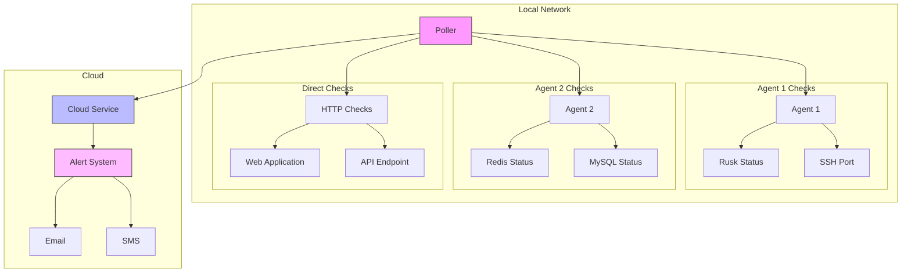

```
 __                                              
|  |--.-----.--------.-----.--------.-----.-----.
|     |  _  |        |  -__|        |  _  |     |
|__|__|_____|__|__|__|_____|__|__|__|_____|__|__|
```


HomeMon is a distributed network monitoring system designed for home networks. It provides real-time monitoring of internal services, with cloud-based alerting capabilities to ensure you stay informed even during network or power outages.

## Overview

HomeMon consists of three main components:
- **Agent**: Runs on each monitored host, checking local services
- **Poller**: Coordinates monitoring activities and reports to the cloud service
- **Cloud Service**: Handles alerting and monitors the health of pollers. Includes API and Web UI.

## Architecture



## Components

### Agent
- Runs as a gRPC server on monitored hosts
- Provides service status through a simple interface
- Supports multiple checker types:
    - Process checker (systemd services)
    - Port checker (TCP ports)
    - Custom checkers can be added

### Poller
- Central coordinator for monitoring activities
- Polls agents at configurable intervals
- Performs direct HTTP/TCP checks for non-agent services
- Reports status to cloud service
- Configurable poll intervals
- Maintains list of agents and services to monitor

### Cloud Service
- Runs on a cloud provider (AWS, GCP, etc.)
- Monitors poller health
- Triggers alerts if:
    - Services report as down
    - Poller stops reporting (network/power outage)
- Supports multiple alert methods (email, SMS)

## Getting Started

### Prerequisites
- Go 1.19 or higher
- gRPC tools
- Access to systemd (for process checking)

**Note**: DUSK node monitoring -- You must configure the ufw firewall on the Ubuntu 
to allow monitoring traffic on port 50051. To do this, run the following command:

```shell
sudo ufw allow 50051/tcp
```

### Installation

1. Clone the repository:
```bash
git clone https://github.com/mfreeman451/homemon.git
cd homemon
```

2. Build the components:
```bash
go build ./cmd/agent
go build ./cmd/poller
go build ./cmd/cloud
```

### Configuration

#### Agent Configuration
```go
checkers := map[string]checker.Checker{
    "rusk": &agent.ProcessChecker{ProcessName: "rusk"},
    "ssh":   &agent.PortChecker{Host: "localhost", Port: 22},
}
```

**JSON Configuration files**

These need to go on the agent/dusk node.

```shell
root@dusk01:/home/duskadmin# cat /etc/homemon/checkers/dusk.json
{
    "name": "dusk",
    "node_address": "localhost:8080",
    "timeout": "5m",
    "listen_addr": ":50052"
}
root@dusk01:/home/duskadmin# cat /etc/homemon/checkers/
dusk.json      external.json
root@dusk01:/home/duskadmin# cat /etc/homemon/checkers/external.json
{
    "name": "dusk",
    "address": "localhost:50052"
}
```

#### Poller Configuration
```go
config := poller.Config{
    Agents: map[string]string{
        "local-agent": "localhost:50051",
    },
    CloudAddress: "cloud-service:50052",
    PollInterval: 30 * time.Second,
    PollerID:     "home-poller-1",
}
```

**/etc/homemon/poller.json**
```json
{
    "agents": {
        "local-agent": {
            "address": "192.168.2.22:50051",
            "checks": [
                {
                    "type": "process",
                    "details": "rusk"
                },
                {
                    "type": "port",
                    "port": 22
                },
                {
                    "type": "dusk"
                }
            ]
        }
    },
    "cloud_address": "cloud-host:50052",
    "poll_interval": "30s",
    "poller_id": "home-poller-1"
}
```

#### Cloud Service Configuration

By default, the cloud service listens on port `50052` for poller connections, and port `8090` for the web dashboard.

##### Configuring the Cloud Service

**Simple Configuration**

```json
{
    "listen_addr": ":8090",
    "alert_threshold": "5m"
}
```

**With WebHooks**

```json
{
  "listen_addr": ":8090",
  "alert_threshold": "5m",
  "webhooks": [
    {
      "enabled": true,
      "url": "https://your-webhook.example.com",
      "cooldown": "15m",
      "headers": [
        {
          "key": "Authorization",
          "value": "Bearer your-token"
        }
      ]
    }
  ]
}
```

**Discord WebHook**

```json
{
    "listen_addr": ":8090",
    "alert_threshold": "5m",
    "webhooks": [
        {
            "enabled": true,
            "url": "https://discord.com/api/webhooks/your-webhook-id/your-webhook-token",
            "cooldown": "15m",
            "template": {
                "embeds": [{
                    "title": "{{.alert.Title}}",
                    "description": "{{.alert.Message}}",
                    "color": {{if eq .alert.Level "error"}}15158332{{else if eq .alert.Level "warning"}}16776960{{else}}3447003{{end}},
                    "timestamp": "{{.alert.Timestamp}}",
                    "fields": [
                        {
                            "name": "Node ID",
                            "value": "{{.alert.NodeID}}",
                            "inline": true
                        }
                        {{range $key, $value := .alert.Details}},
                        {
                            "name": "{{$key}}",
                            "value": "{{$value}}",
                            "inline": true
                        }
                        {{end}}
                    ]
                }]
            }
        }
    ]
}
```

## Contributing

Contributions are welcome! Please feel free to submit a Pull Request.

## License

This project is licensed under the Apache 2.0 License - see the LICENSE file for details.

## Project Status

This project is in early development. Features and APIs may change significantly.

## Roadmap

- [ ] Add more checker types
- [ ] Implement secure authentication
- [ ] Add metrics collection
- [x] Create web dashboard
- [ ] Add support for custom alert integrations
- [ ] Implement configuration file support
