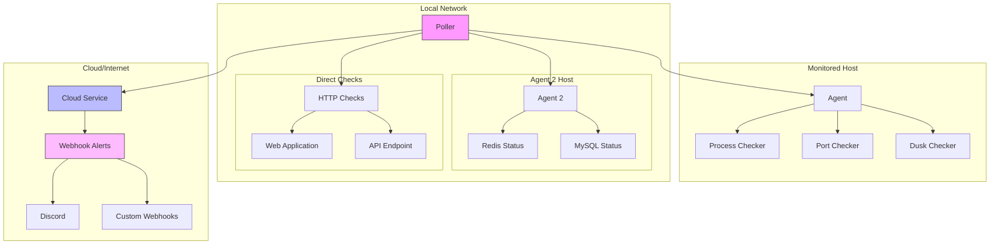

# HomeMon

```
 __                                              
|  |--.-----.--------.-----.--------.-----.-----.
|     |  _  |        |  -__|        |  _  |     |
|__|__|_____|__|__|__|_____|__|__|__|_____|__|__|
```

HomeMon is a distributed network monitoring system designed for monitoring home infrastructure and services. It provides real-time monitoring of internal services, with cloud-based alerting capabilities to ensure you stay informed even during network or power outages.

## Architecture

HomeMon uses a distributed architecture with three main components:



### Components

1. **Agent** (runs on monitored hosts)
  - Provides service status through gRPC
  - Supports multiple checker types:
    - Process checker (systemd services)
    - Port checker (TCP ports)
    - Custom checkers (e.g., Dusk node)
  - Must run on each host you want to monitor

2. **Poller** (runs anywhere in your network)
  - Coordinates monitoring activities
  - Can run on the same host as an agent or separately
  - Polls agents at configurable intervals
  - Reports status to cloud service
  - Multiple pollers can report to the same cloud service

3. **Cloud Service** (runs on a reliable host)
  - Receives reports from pollers
  - Provides web dashboard
  - Sends alerts via webhooks (Discord, etc.)
  - Should run on a reliable host outside your network

## Installation

HomeMon components are distributed as Debian packages. Each component has its own package:

### Building Packages

1. Clone the repository:
```bash
git clone https://github.com/mfreeman451/homemon.git
cd homemon
```

2. Build the agent package:
```bash
./setup-deb-agent.sh
```

3. Build the poller package:
```bash
./setup-deb-poller.sh
```

4. Build the cloud package:
```bash
./setup-deb-cloud.sh
```

### Installation Order and Location

1. **Agent Installation** (on monitored hosts):
```bash
sudo dpkg -i homemon-dusk_1.0.0.deb  # For Dusk nodes
# or
sudo dpkg -i homemon-agent_1.0.0.deb  # For other hosts
```

2. **Poller Installation** (on any host in your network):
```bash
sudo dpkg -i homemon-poller_1.0.0.deb
```

3. **Cloud Installation** (on a reliable host):
```bash
sudo dpkg -i homemon-cloud_1.0.0.deb
```

## Configuration

### Agent Configuration

Default location: `/etc/homemon/checkers/`

For Dusk nodes:
```json
# /etc/homemon/checkers/dusk.json
{
    "name": "dusk",
    "node_address": "localhost:8080",
    "timeout": "5m",
    "listen_addr": ":50052"
}

# /etc/homemon/checkers/external.json
{
    "name": "dusk",
    "address": "localhost:50052"
}
```

### Poller Configuration

Default location: `/etc/homemon/poller.json`

```json
{
    "agents": {
        "local-agent": {
            "address": "127.0.0.1:50051",
            "checks": [
                {
                    "type": "dusk"
                }
            ]
        }
    },
    "cloud_address": "cloud-host:50052",
    "poll_interval": "30s",
    "poller_id": "home-poller-1"
}
```

### Cloud Configuration

Default location: `/etc/homemon/cloud.json`

```json
{
    "listen_addr": ":8090",
    "alert_threshold": "5m",
    "known_pollers": ["home-poller-1"],
    "webhooks": [
        {
            "enabled": true,
            "url": "https://discord.com/api/webhooks/your-webhook-url",
            "cooldown": "15m",
            "template": "{\"embeds\":[{\"title\":\"{{.alert.Title}}\",\"description\":\"{{.alert.Message}}\",\"color\":{{if eq .alert.Level \"error\"}}15158332{{else if eq .alert.Level \"warning\"}}16776960{{else}}3447003{{end}},\"timestamp\":\"{{.alert.Timestamp}}\",\"fields\":[{\"name\":\"Node ID\",\"value\":\"{{.alert.NodeID}}\",\"inline\":true}{{range $key, $value := .alert.Details}},{\"name\":\"{{$key}}\",\"value\":\"{{$value}}\",\"inline\":true}{{end}}]}]}"
        }
    ]
}
```

## Deployment Recommendations

1. **Agent Deployment**:
  - Must run on each host you want to monitor
  - For Dusk nodes, use the homemon-dusk package
  - For other hosts, use the homemon-agent package
  - Requires port 50051 to be accessible to the poller

2. **Poller Deployment**:
  - Can run on the same host as an agent or separately
  - Must be able to reach all agents
  - Must be able to reach the cloud service
  - Multiple pollers can report to the same cloud service
  - Each poller needs a unique poller_id

3. **Cloud Service Deployment**:
  - Should run on a reliable host outside your network
  - Needs to be accessible by all pollers
  - Provides web interface on port 8090
  - Should have reliable internet for webhook alerts

### Firewall Configuration

If you're using UFW (Ubuntu's Uncomplicated Firewall), here are the required rules:

```bash
# On agent hosts
sudo ufw allow 50051/tcp  # For agent gRPC server
sudo ufw allow 50052/tcp  # For Dusk checker (if applicable)

# On cloud host
sudo ufw allow 50052/tcp  # For poller connections
sudo ufw allow 8090/tcp   # For web interface
```

## Web Interface

The web interface is available at `http://cloud-host:8090` and provides:
- Overall system status
- Individual node status
- Service status for each node
- Historical availability data
- Dusk node specific information

## Contributing

Contributions are welcome! Please feel free to submit a Pull Request.

## License

This project is licensed under the Apache 2.0 License - see the LICENSE file for details.