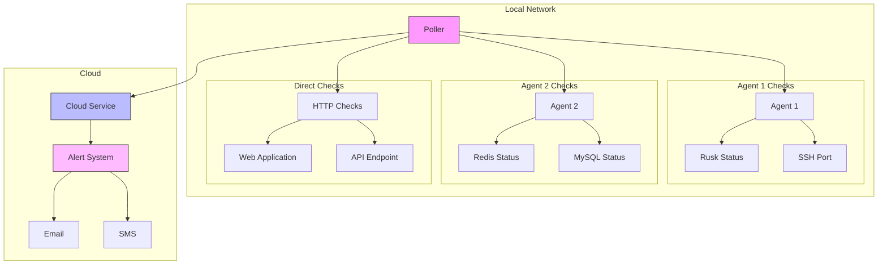

# HomeMon

HomeMon is a distributed network monitoring system designed for home networks. It provides real-time monitoring of internal services, with cloud-based alerting capabilities to ensure you stay informed even during network or power outages.

## Overview

HomeMon consists of three main components:
- **Agent**: Runs on each monitored host, checking local services
- **Poller**: Coordinates monitoring activities and reports to the cloud service
- **Cloud Service**: Handles alerting and monitors the health of pollers

## Architecture



## Components

### Agent
- Runs as a gRPC server on monitored hosts
- Provides service status through a simple interface
- Supports multiple checker types:
    - Process checker (systemd services)
    - Port checker (TCP ports)
    - Custom checkers can be added

### Poller
- Central coordinator for monitoring activities
- Polls agents at configurable intervals
- Performs direct HTTP/TCP checks for non-agent services
- Reports status to cloud service
- Configurable poll intervals
- Maintains list of agents and services to monitor

### Cloud Service
- Runs on a cloud provider (AWS, GCP, etc.)
- Monitors poller health
- Triggers alerts if:
    - Services report as down
    - Poller stops reporting (network/power outage)
- Supports multiple alert methods (email, SMS)

## Getting Started

### Prerequisites
- Go 1.19 or higher
- gRPC tools
- Access to systemd (for process checking)

**Note**: DUSK node monitoring -- You must configure the ufw firewall on the Ubuntu 
to allow monitoring traffic on port 50051. To do this, run the following command:

```shell
sudo ufw allow 50051/tcp
```

### Installation

1. Clone the repository:
```bash
git clone https://github.com/mfreeman451/homemon.git
cd homemon
```

2. Build the components:
```bash
go build ./cmd/agent
go build ./cmd/poller
go build ./cmd/cloud
```

### Configuration

#### Agent Configuration
```go
checkers := map[string]checker.Checker{
    "rusk": &agent.ProcessChecker{ProcessName: "rusk"},
    "ssh":   &agent.PortChecker{Host: "localhost", Port: 22},
}
```

#### Poller Configuration
```go
config := poller.Config{
    Agents: map[string]string{
        "local-agent": "localhost:50051",
    },
    CloudAddress: "cloud-service:50052",
    PollInterval: 30 * time.Second,
    PollerID:     "home-poller-1",
}
```

#### Cloud Service Configuration
```go
cloudServer := cloud.NewServer(5*time.Minute, alertFunc)
```

## Contributing

Contributions are welcome! Please feel free to submit a Pull Request.

## License

This project is licensed under the MIT License - see the LICENSE file for details.

## Project Status

This project is in early development. Features and APIs may change significantly.

## Roadmap

- [ ] Add more checker types
- [ ] Implement secure authentication
- [ ] Add metrics collection
- [ ] Create web dashboard
- [ ] Add support for custom alert integrations
- [ ] Implement configuration file support