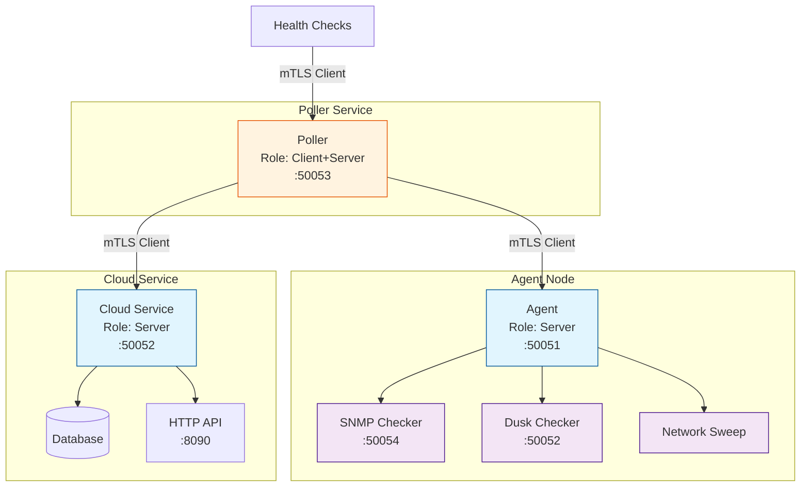

# Security Configuration

ServiceRadar supports multiple security modes for gRPC communication between components. Choose the mode that best fits your environment and security requirements.



## Quick Start

The simplest secure configuration uses basic TLS:

```json
{
  "security": {
    "mode": "tls",
    "cert_dir": "/etc/serviceradar/certs"
  }
}
```

## Security Modes

### Development Mode (No Security)
⚠️ **Not recommended for production use**

```json
{
  "security": {
    "mode": "none"
  }
}
```

### Basic TLS
Provides encryption and server authentication:

```json
{
  "security": {
    "mode": "tls",
    "cert_dir": "/etc/serviceradar/certs"
  }
}
```

Required files in cert_dir:
- `ca.crt`: Certificate Authority certificate
- `server.crt`: Server certificate
- `server.key`: Server private key

### Mutual TLS (mTLS)
Provides encryption with both server and client authentication:

```json
{
  "security": {
    "mode": "mtls",
    "cert_dir": "/etc/serviceradar/certs"
  }
}
```

Required files in cert_dir:
- `ca.crt`: Certificate Authority certificate
- `server.crt`: Server certificate
- `server.key`: Server private key
- `client.crt`: Client certificate
- `client.key`: Client private key

### SPIFFE/SPIRE Integration
Zero-trust workload identity using SPIFFE:

```json
{
  "security": {
    "mode": "spiffe",
    "trust_domain": "example.org",
    "workload_socket": "unix:/run/spire/sockets/agent.sock"
  }
}
```

## Kubernetes Deployment

### With SPIFFE/SPIRE

```yaml
apiVersion: v1
kind: Pod
metadata:
  name: serviceradar
spec:
  containers:
  - name: serviceradar
    image: serviceradar:latest
    env:
    - name: SR_SECURITY_MODE
      value: "spiffe"
    - name: SR_TRUST_DOMAIN
      value: "example.org"
    volumeMounts:
    - name: spire-socket
      mountPath: /run/spire/sockets
      readOnly: true
  volumes:
  - name: spire-socket
    hostPath:
      path: /run/spire/sockets
      type: Directory
```

### With mTLS

```yaml
apiVersion: v1
kind: Pod
metadata:
  name: serviceradar
spec:
  containers:
  - name: serviceradar
    image: serviceradar:latest
    env:
    - name: SR_SECURITY_MODE
      value: "mtls"
    - name: SR_CERT_DIR
      value: "/etc/serviceradar/certs"
    volumeMounts:
    - name: certs
      mountPath: /etc/serviceradar/certs
      readOnly: true
  volumes:
  - name: certs
    secret:
      secretName: serviceradar-certs
```

## Certificate Management

### Generating Self-Signed Certificates

For testing or development environments, you can generate self-signed certificates using the provided tool:

```bash
# Generate basic TLS certificates
serviceradar cert generate --dir /etc/serviceradar/certs

# Generate mTLS certificates (includes client certs)
serviceradar cert generate --dir /etc/serviceradar/certs --mtls

# View certificate information
serviceradar cert info --dir /etc/serviceradar/certs
```

### Using Existing PKI

If you have an existing PKI infrastructure, place your certificates in the configured certificate directory:

```bash
# Example directory structure
/etc/serviceradar/certs/
├── ca.crt
├── server.crt
├── server.key
├── client.crt  # Only needed for mTLS
└── client.key  # Only needed for mTLS
```

### Certificate Rotation

ServiceRadar automatically detects and reloads certificates when they change. For SPIFFE mode, certificate rotation is handled automatically by the SPIFFE Workload API.

## Environment Variables

All security settings can be configured via environment variables:

```bash
# Security mode
export SR_SECURITY_MODE=mtls

# Certificate directory for TLS/mTLS modes
export SR_CERT_DIR=/etc/serviceradar/certs

# SPIFFE configuration
export SR_TRUST_DOMAIN=example.org
export SR_WORKLOAD_SOCKET=unix:/run/spire/sockets/agent.sock
```

## Security Best Practices

1. Always use a secure mode in production environments
2. Regularly rotate certificates
3. Use mTLS or SPIFFE for zero-trust environments
4. Keep private keys protected (0600 permissions)
5. Monitor certificate expiration
6. Use separate certificates for different components

## Troubleshooting

Common issues and solutions:

1. **Certificate not found errors**
    - Verify certificate paths
    - Check file permissions
    - Ensure certificates are in PEM format

2. **SPIFFE Workload API connection issues**
    - Check SPIFFE agent is running
    - Verify socket path and permissions
    - Confirm trust domain configuration

3. **mTLS authentication failures**
    - Verify client and server certificates are signed by the same CA
    - Check certificate expiration dates
    - Confirm trust domain matches (SPIFFE mode)

For more detailed security configuration and best practices, see the [full documentation](https://docs.serviceradar.example.com/security).