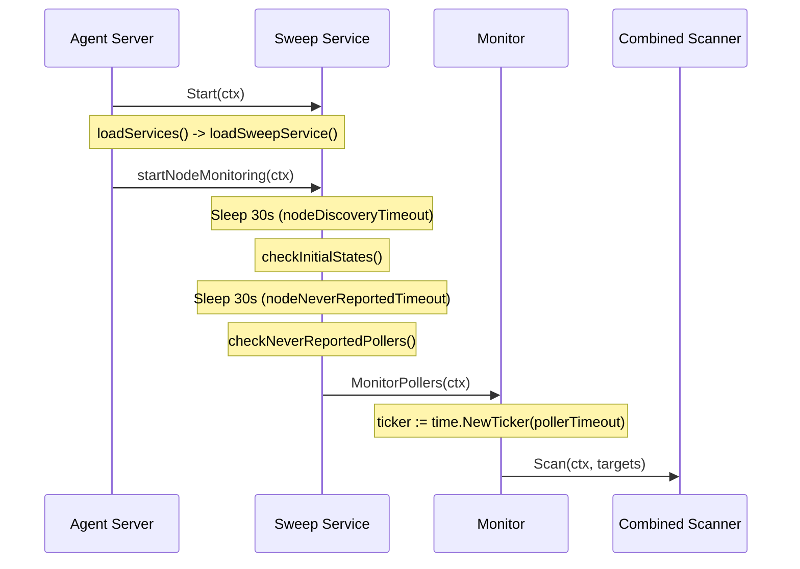

# agent

## Startup Sequence

```mermaid
sequenceDiagram
    participant A as Agent Server
    participant S as Sweep Service
    participant M as Monitor
    participant CS as Combined Scanner

    A->>S: Start(ctx)
    Note over A,S: loadServices() -> loadSweepService()
    
    A->>S: startNodeMonitoring(ctx)
    Note over S: Sleep 30s (nodeDiscoveryTimeout)
    Note over S: checkInitialStates()
    Note over S: Sleep 30s (nodeNeverReportedTimeout)
    Note over S: checkNeverReportedPollers()
    
    S->>M: MonitorPollers(ctx)
    Note over M: ticker := time.NewTicker(pollerTimeout)
    M->>CS: Scan(ctx, targets)
```