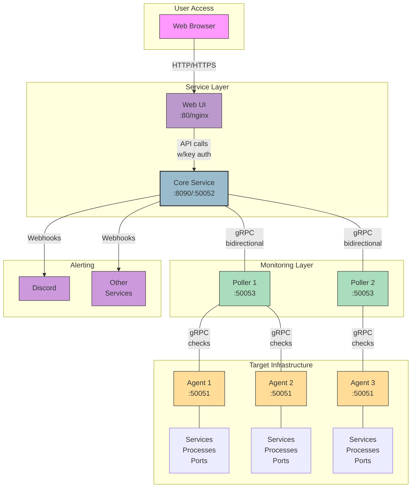
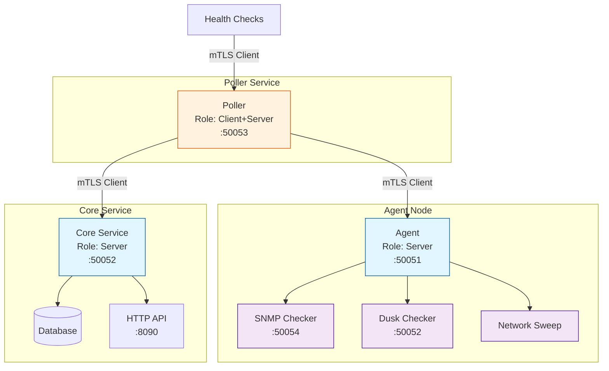
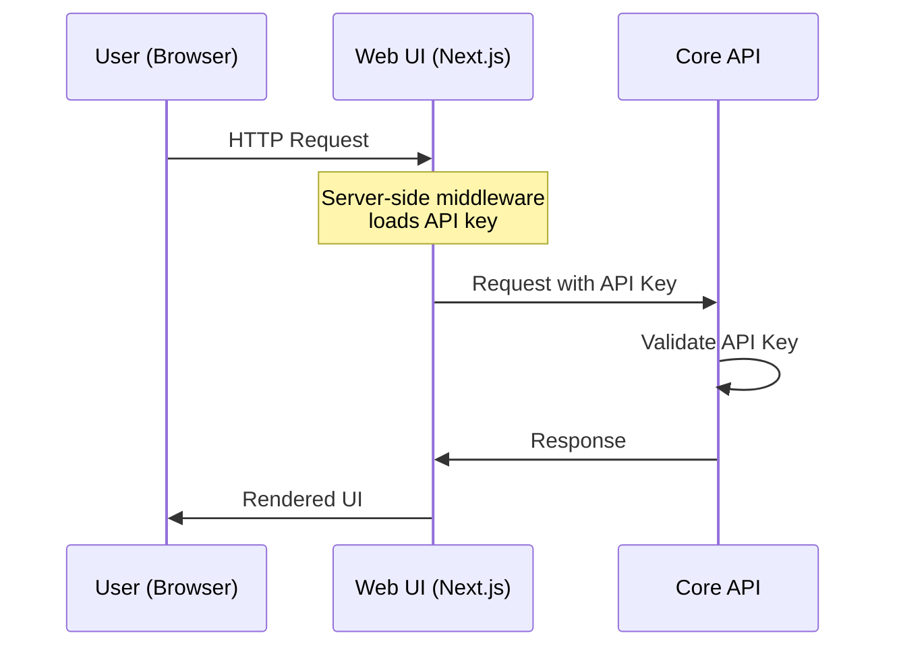
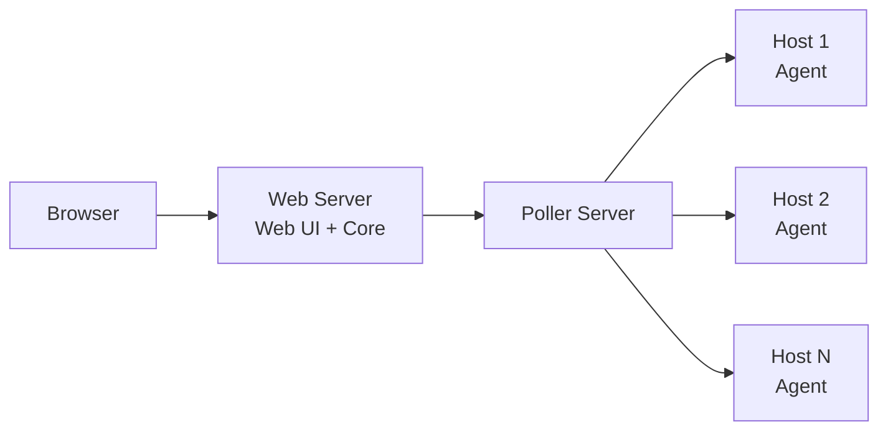
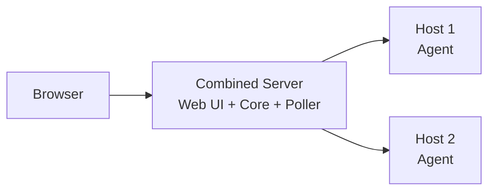
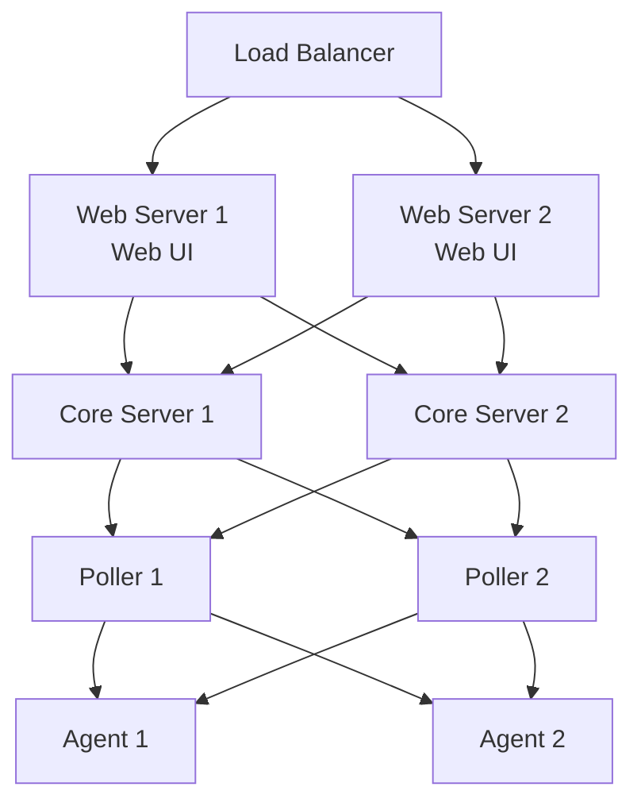

# ServiceRadar Architecture

ServiceRadar uses a distributed, multi-layered architecture designed for flexibility, reliability, and security. This page explains how the different components work together to provide robust monitoring capabilities.

## Architecture Overview

## Key Components

### Agent (Monitored Host)

The Agent runs on each host you want to monitor and is responsible for:

- Collecting service status information (process status, port availability, etc.)
- Exposing a gRPC service on port 50051 for Pollers to query
- Supporting various checker types (process, port, SNMP, etc.)
- Running with minimal privileges for security

**Technical Details:**
- Written in Go for performance and minimal dependencies
- Uses gRPC for efficient, language-agnostic communication
- Supports dynamic loading of checker plugins
- Can run on constrained hardware with minimal resource usage

### Poller (Monitoring Coordinator)

The Poller coordinates monitoring activities and is responsible for:

- Querying multiple Agents at configurable intervals
- Aggregating status data from Agents
- Reporting status to the Core Service
- Performing direct checks (HTTP, ICMP, etc.)
- Supporting network sweeps and discovery

**Technical Details:**
- Runs on port 50053 for gRPC communications
- Stateless design allows multiple Pollers for high availability
- Configurable polling intervals for different check types
- Supports both pull-based (query) and push-based (events) monitoring

### Core Service (API & Processing)

The Core Service is the central component that:

- Receives and processes reports from Pollers
- Provides an API for the Web UI on port 8090
- Triggers alerts based on configurable thresholds
- Stores historical monitoring data
- Manages webhook notifications

**Technical Details:**
- Exposes a gRPC service on port 50052 for Poller connections
- Provides a RESTful API on port 8090 for the Web UI
- Uses role-based security model
- Implements webhook templating for flexible notifications

### Web UI (User Interface)

The Web UI provides a modern dashboard interface that:

- Visualizes the status of monitored services
- Displays historical performance data
- Provides configuration management
- Securely communicates with the Core Service API

**Technical Details:**
- Built with Next.js in SSR mode for security and performance
- Uses Nginx as a reverse proxy on port 80
- Communicates with the Core Service API using a secure API key
- Supports responsive design for mobile and desktop

## Security Architecture

ServiceRadar implements multiple layers of security:

### mTLS Security

For network communication between components, ServiceRadar supports mutual TLS (mTLS):

### API Authentication

The Web UI communicates with the Core Service using API key authentication:

For details on configuring security, see the [TLS Security](./tls-security.md) documentation.

## Deployment Models

ServiceRadar supports multiple deployment models:

### Standard Deployment

All components installed on separate machines for optimal security and reliability:

### Minimal Deployment

For smaller environments, components can be co-located:

### High Availability Deployment

For mission-critical environments:

## Network Requirements

ServiceRadar uses the following network ports:

| Component | Port | Protocol | Purpose |
|-----------|------|----------|---------|
| Agent | 50051 | gRPC/TCP | Service status queries |
| Poller | 50053 | gRPC/TCP | Health checks |
| Core | 50052 | gRPC/TCP | Poller connections |
| Core | 8090 | HTTP/TCP | API (internal) |
| Web UI | 80/443 | HTTP(S)/TCP | User interface |
| SNMP Checker | 50054 | gRPC/TCP | SNMP status queries |
| Dusk Checker | 50052 | gRPC/TCP | Dusk node monitoring |

For more information on deploying ServiceRadar, see the [Installation Guide](./installation.md).