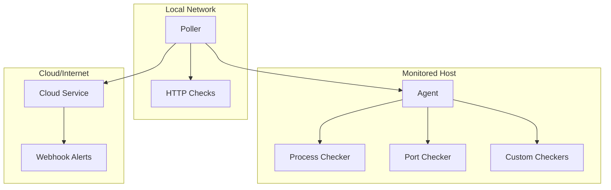

# Introduction to ServiceRadar

Welcome to ServiceRadar! This guide will help you get started with monitoring your infrastructure, whether you're running a single server or a complex distributed network.

## What is ServiceRadar?

ServiceRadar is a distributed network monitoring system designed for infrastructure and services in hard-to-reach places or constrained environments. It provides real-time monitoring of internal services, with cloud-based alerting capabilities to ensure you stay informed even during network or power outages.

:::tip Quick Install

```bash
# On your monitored host:
curl -LO https://github.com/mfreeman451/serviceradar/releases/download/1.0.19/serviceradar-agent_1.0.19.deb
sudo dpkg -i serviceradar-agent_1.0.19.deb
```

:::

## Key Features

- **Real-time Monitoring**: Monitor systemd services, TCP ports, and custom services
- **Cloud Integration**: Cloud-based alerting ensures uptime visibility
- **SNMP Support**: Deep network monitoring with SNMP integration
- **Network Scanning**: Built-in network sweep capabilities
- **Secure Design**: Enterprise-grade security with mTLS support
- **Distributed Architecture**: Scale from single host to complex networks

## System Architecture

ServiceRadar uses a distributed architecture with three main components:



### Components

1. **Agent**
    - Runs on monitored hosts
    - Provides service status via gRPC
    - Supports multiple checker types:
        - Process monitoring (systemd)
        - Port checking (TCP)
        - Custom integrations

2. **Poller**
    - Coordinates monitoring activities
    - Runs anywhere in your network
    - Polls agents at configurable intervals
    - Reports to cloud service
    - Multiple pollers supported

3. **Cloud Service**
    - Receives poller reports
    - Provides web dashboard
    - Sends webhook alerts
    - Runs on reliable external host

## Prerequisites

Before you begin, ensure you have:

- A Linux-based system (Ubuntu/Debian recommended)
- Root or sudo access
- Basic understanding of:
    - Linux system administration
    - Network services
    - Basic security concepts

:::note System Requirements

- **Agent**: 256MB RAM, 1 CPU core
- **Poller**: 512MB RAM, 2 CPU cores
- **Cloud Service**: 1GB RAM, 2 CPU cores

:::

## Quick Start

Follow these steps to get started:

1. **Install the Agent**
   ```bash
   curl -LO https://github.com/mfreeman451/serviceradar/releases/download/1.0.19/serviceradar-agent_1.0.19.deb
   sudo dpkg -i serviceradar-agent_1.0.19.deb
   ```

2. **Install the Poller**
   ```bash
   curl -LO https://github.com/mfreeman451/serviceradar/releases/download/1.0.19/serviceradar-poller_1.0.19.deb
   sudo dpkg -i serviceradar-poller_1.0.19.deb
   ```

3. **Install the Cloud Service**
   ```bash
   curl -LO https://github.com/mfreeman451/serviceradar/releases/download/1.0.19/serviceradar-cloud_1.0.19.deb
   sudo dpkg -i serviceradar-cloud_1.0.19.deb
   ```

:::caution Before Production Use

Always configure security settings and update default passwords before exposing services to the network.

:::

## Optional Components

ServiceRadar offers additional components for specific monitoring needs:

### SNMP Monitoring
```bash
curl -LO https://github.com/mfreeman451/serviceradar/releases/download/1.0.19/serviceradar-snmp-checker_1.0.19.deb
sudo dpkg -i serviceradar-snmp-checker_1.0.19.deb
```

### Dusk Node Monitoring
```bash
curl -LO https://github.com/mfreeman451/serviceradar/releases/download/1.0.19/serviceradar-dusk-checker_1.0.19.deb
sudo dpkg -i serviceradar-dusk-checker_1.0.19.deb
```

## Web Interface

After installation, access the web interface at `http://cloud-host:8090` to view:

- Overall system status
- Individual node status
- Service health metrics
- Historical availability data
- Alert configurations


## Next Steps

- [Detailed Installation Guide](installation.md)
- [Basic Configuration](configuration.md)
- [Security Setup](../security/overview.md)
- [SNMP Configuration](../features/snmp-monitoring.md)

## Getting Help

If you run into issues:

1. Check the [Troubleshooting Guide](../troubleshooting/common-issues.md)
2. Review [Known Issues](../troubleshooting/known-issues.md)
3. Join our [Community Forum](https://forum.serviceradar.io)

## Contributing

ServiceRadar is open source and contributions are welcome! Check our [Contributing Guide](../contributing/guidelines.md) to get started.

## Project Status

[](https://github.com/mfreeman451/serviceradar/actions/workflows/release.yml)
[](https://github.com/mfreeman451/serviceradar/actions/workflows/tests.yml)
[](https://github.com/mfreeman451/serviceradar/actions/workflows/go-coverage.yml)