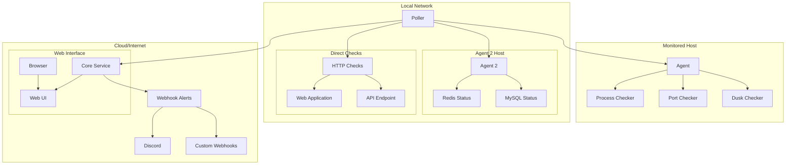

# ServiceRadar Introduction

ServiceRadar is a distributed network monitoring system designed for infrastructure and services in hard-to-reach places or constrained environments. It provides real-time monitoring of internal services with cloud-based alerting capabilities, ensuring you stay informed even during network or power outages.

## What is ServiceRadar?

ServiceRadar offers:
- Real-time monitoring of internal services
- Cloud-based alerting capabilities
- Continuous monitoring during network or power outages
- Distributed architecture for scalability and reliability
- SNMP integration for network device monitoring
- Specialized monitoring for specific node types (e.g., Dusk Network)
- Secure communication with mTLS support
- Modern web UI with dashboard visualization
- API key authentication for internal communications

:::tip What you'll need
- Linux-based system (Ubuntu/Debian recommended)
- Root or sudo access
- Basic understanding of network services
- Target services to monitor
  :::

## Key Components

ServiceRadar consists of four main components:

1. **Agent** - Runs on monitored hosts, provides service status through gRPC
2. **Poller** - Coordinates monitoring activities, can run anywhere in your network
3. **Core Service** - Receives reports from pollers, provides API, and sends alerts
4. **Web UI** - Provides a modern dashboard interface with Nginx as a reverse proxy

## System Architecture

ServiceRadar uses a distributed architecture that allows for flexible deployment across different networks and environments:

## Security Features

ServiceRadar is designed with security in mind:

1. **mTLS Authentication** - Secure communication between components using mutual TLS
2. **API Key Authentication** - Secure API access for the web interface
3. **Role-Based Access** - Different components have different security roles
4. **Nginx Reverse Proxy** - Secure web access with configurable firewall rules

## Getting Started

Navigate through our documentation to get ServiceRadar up and running:

1. **[Installation Guide](./installation.md)** - Install ServiceRadar components
2. **[Configuration Basics](./configuration.md)** - Configure your ServiceRadar deployment
3. **[TLS Security](./tls-security.md)** - Secure your ServiceRadar communications
4. **[Web UI Configuration](./web-ui.md)** - Set up the web interface and dashboard

Or jump straight to the [Installation Guide](./installation.md) to get started with ServiceRadar.