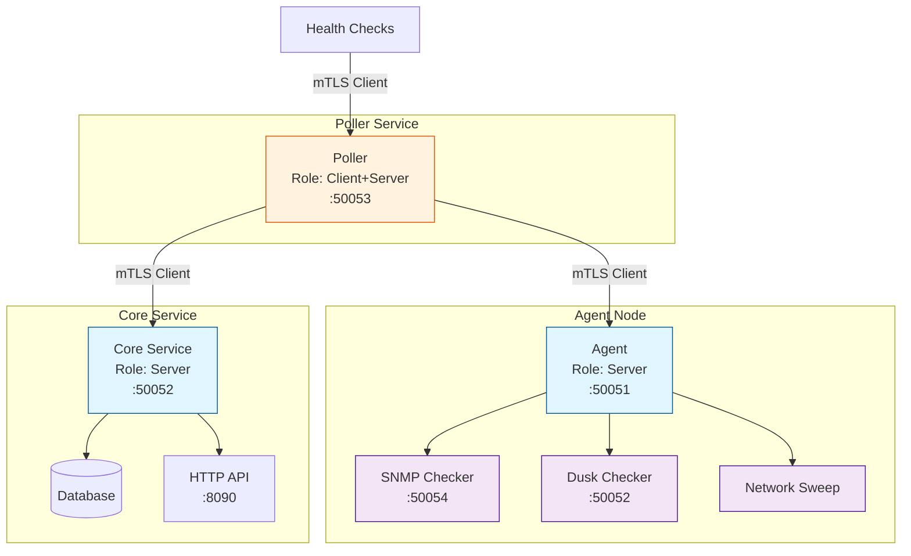

# TLS Security

ServiceRadar supports mutual TLS (mTLS) authentication to secure communications between components. This guide explains how to set up and configure mTLS for your ServiceRadar deployment.

## Security Architecture

ServiceRadar components communicate securely using mTLS with the following roles:



## Certificate Overview

ServiceRadar uses the following certificate files:
- `root.pem` - The root CA certificate
- `server.pem` - Server certificate
- `server-key.pem` - Server private key
- `client.pem` - Client certificate
- `client-key.pem` - Client private key

## Certificate Generation

### 1. Install cfssl

First, install the CloudFlare SSL toolkit (cfssl) which we'll use for generating certificates:

```bash
go install github.com/cloudflare/cfssl/cmd/...@latest
```

### 2. Create Configuration Files

Create `cfssl.json`:
```json
{
    "signing": {
        "default": {
            "expiry": "8760h"
        },
        "profiles": {
            "rootca": {
                "usages": ["signing", "key encipherment", "server auth", "client auth"],
                "expiry": "8760h",
                "ca_constraint": {
                    "is_ca": true,
                    "max_path_len": 0
                }
            },
            "server": {
                "usages": ["signing", "key encipherment", "server auth"],
                "expiry": "8760h"
            },
            "client": {
                "usages": ["signing", "key encipherment", "client auth"],
                "expiry": "8760h"
            }
        }
    }
}
```

Create `csr.json`:
```json
{
    "hosts": ["localhost", "127.0.0.1"],
    "key": {
        "algo": "ecdsa",
        "size": 256
    },
    "names": [{
        "O": "ServiceRadar"
    }]
}
```

:::note
Modify the "hosts" array in csr.json to include the actual hostnames and IP addresses of your ServiceRadar components.
:::

### 3. Generate Certificates

Generate the root CA:
```bash
cfssl selfsign -config cfssl.json --profile rootca "ServiceRadar CA" csr.json | cfssljson -bare root
```

Generate server and client keys:
```bash
cfssl genkey csr.json | cfssljson -bare server
cfssl genkey csr.json | cfssljson -bare client
```

Sign the certificates:
```bash
cfssl sign -ca root.pem -ca-key root-key.pem -config cfssl.json -profile server server.csr | cfssljson -bare server
cfssl sign -ca root.pem -ca-key root-key.pem -config cfssl.json -profile client client.csr | cfssljson -bare client
```

## Certificate Deployment

### Role-Based Requirements

Different ServiceRadar components need different certificates based on their role:

| Component | Role | Certificates Needed |
|-----------|------|---------------------|
| Poller | Client+Server | All certificates (client + server) |
| Agent | Client+Server | All certificates (client + server) |
| Core | Server only | Server certificates only |
| Checker | Server only | Server certificates only |

### Installation Steps

1. Create the certificates directory:
```bash
sudo mkdir -p /etc/serviceradar/certs
sudo chown serviceradar:serviceradar /etc/serviceradar/certs
sudo chmod 700 /etc/serviceradar/certs
```

2. Install certificates based on role:

For core/checker (server-only):
```bash
sudo cp root.pem server*.pem /etc/serviceradar/certs/
```

For poller/agent (full set):
```bash
sudo cp root.pem server*.pem client*.pem /etc/serviceradar/certs/
```

3. Set permissions:
```bash
sudo chown serviceradar:serviceradar /etc/serviceradar/certs/*
sudo chmod 644 /etc/serviceradar/certs/*.pem
sudo chmod 600 /etc/serviceradar/certs/*-key.pem
```

### Expected Directory Structure

Server-only deployment (Core/Checker):
```bash
/etc/serviceradar/certs/
├── root.pem           (644)
├── server.pem         (644)
└── server-key.pem     (600)
```

Full deployment (Poller/Agent):
```bash
/etc/serviceradar/certs/
├── root.pem           (644)
├── server.pem         (644)
├── server-key.pem     (600)
├── client.pem         (644)
└── client-key.pem     (600)
```

## Component Configuration

### Agent Configuration

Update `/etc/serviceradar/agent.json`:

```json
{
  "checkers_dir": "/etc/serviceradar/checkers",
  "listen_addr": ":50051",
  "service_type": "grpc",
  "service_name": "AgentService",
  "security": {
    "mode": "mtls",
    "cert_dir": "/etc/serviceradar/certs",
    "server_name": "poller-hostname",
    "role": "agent"
  }
}
```

- Set `mode` to `mtls`
- Set `server_name` to the hostname/IP address of the poller
- Set `role` to `agent`

### Poller Configuration

Update `/etc/serviceradar/poller.json`:

```json
{
  "agents": {
    "local-agent": {
      "address": "agent-hostname:50051",
      "security": {
        "server_name": "agent-hostname",
        "mode": "mtls"
      },
      "checks": [
        // your checks here
      ]
    }
  },
  "core_address": "core-hostname:50052",
  "listen_addr": ":50053",
  "poll_interval": "30s",
  "poller_id": "my-poller",
  "service_name": "PollerService",
  "service_type": "grpc",
  "security": {
    "mode": "mtls",
    "cert_dir": "/etc/serviceradar/certs",
    "server_name": "core-hostname",
    "role": "poller"
  }
}
```

### Core Configuration

Update `/etc/serviceradar/core.json`:

```json
{
  "listen_addr": ":8090",
  "grpc_addr": ":50052",
  "alert_threshold": "5m",
  "known_pollers": ["my-poller"],
  "metrics": {
    "enabled": true,
    "retention": 100,
    "max_nodes": 10000
  },
  "security": {
    "mode": "mtls",
    "cert_dir": "/etc/serviceradar/certs",
    "role": "core"
  }
}
```

## Verification

Verify your installation with:
```bash
ls -la /etc/serviceradar/certs/
```

Example output (Core instance):
```
total 20
drwx------ 2 serviceradar serviceradar 4096 Feb 21 20:46 .
drwxr-xr-x 3 serviceradar serviceradar 4096 Feb 21 22:35 ..
-rw-r--r-- 1 serviceradar serviceradar  920 Feb 21 04:47 root.pem
-rw------- 1 serviceradar serviceradar  227 Feb 21 20:44 server-key.pem
-rw-r--r-- 1 serviceradar serviceradar  928 Feb 21 20:45 server.pem
```

## Troubleshooting

Common issues and solutions:

1. **Permission denied**
   - Verify directory permissions: `700`
   - Verify file permissions: `644` for certificates, `600` for keys
   - Check ownership: `serviceradar:serviceradar`

2. **Certificate not found**
   - Confirm all required certificates for the role are present
   - Double-check file paths in configuration

3. **Invalid certificate**
   - Ensure certificates are properly formatted PEM files
   - Verify certificates were generated with correct profiles

4. **Connection refused**
   - Verify server name in config matches certificate CN
   - Check that all required certificates are present for the role
   - Confirm service has proper read permissions

5. **Testing with grpcurl**
   - Install grpcurl: `go install github.com/fullstorydev/grpcurl/cmd/grpcurl@latest`
   - Test health check endpoint with mTLS:
     ```bash
     grpcurl -cacert root.pem \
             -cert client.pem \
             -key client-key.pem \
             -servername <SERVER_IP> \
             <SERVER_IP>:50052 \
             grpc.health.v1.Health/Check
     ```
   - Successful response should show:
     ```json
     {
       "status": "SERVING"
     }
     ```
   - If this fails but certificates are correct, verify:
      - Server is running and listening on specified port
      - Firewall rules allow the connection
      - The servername matches the certificate's Common Name (CN)