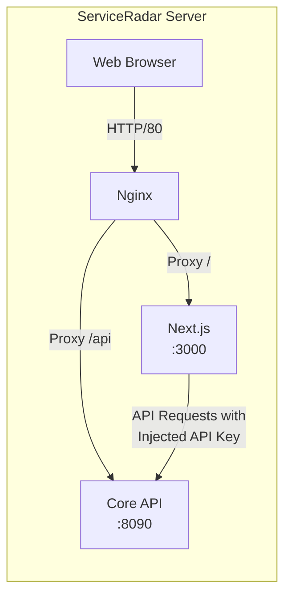

# Web UI Configuration

ServiceRadar includes a modern web interface built with Next.js that provides a dashboard for monitoring your infrastructure. This guide explains how to install, configure, and secure the web UI component.

## Overview

The ServiceRadar web interface:
- Provides a visual dashboard for monitoring your infrastructure
- Communicates securely with the ServiceRadar API
- Uses Nginx as a reverse proxy to handle HTTP requests
- Automatically configures security with API key authentication

## Architecture



- **Nginx** runs on port 80 and acts as the main entry point
- **Next.js** provides the web UI on port 3000
- **Core API** service runs on port 8090
- API requests from the UI are secured with an automatically generated API key

## Installation

The web UI is installed via the `serviceradar-web` package:

```bash
curl -LO https://github.com/carverauto/serviceradar/releases/download/1.0.21/serviceradar-web_1.0.21.deb
sudo dpkg -i serviceradar-web_1.0.21.deb
```

:::note
It's recommended to install the `serviceradar-core` package first, as the web UI depends on it.
:::

## Configuration

### Web UI Configuration

Edit `/etc/serviceradar/web.json`:

```json
{
  "port": 3000,
  "host": "0.0.0.0",
  "api_url": "http://localhost:8090"
}
```

- `port`: The port for the Next.js application (default: 3000)
- `host`: The host address to bind to
- `api_url`: The URL for the core API service

### Nginx Configuration

The web package automatically configures Nginx. The main configuration file is located at `/etc/nginx/conf.d/serviceradar-web.conf`:

```nginx
# ServiceRadar Web Interface - Nginx Configuration
server {
    listen 80;
    server_name _; # Catch-all server name (use your domain if you have one)

    access_log /var/log/nginx/serviceradar-web.access.log;
    error_log /var/log/nginx/serviceradar-web.error.log;

    # API proxy (assumes serviceradar-core package is installed)
    location /api/ {
        proxy_pass http://localhost:8090;
        proxy_set_header Host $host;
        proxy_set_header X-Real-IP $remote_addr;
        proxy_set_header X-Forwarded-For $proxy_add_x_forwarded_for;
        proxy_set_header X-Forwarded-Proto $scheme;
    }

    # Support for Next.js WebSockets (if used)
    location /_next/webpack-hmr {
        proxy_pass http://localhost:3000;
        proxy_http_version 1.1;
        proxy_set_header Upgrade $http_upgrade;
        proxy_set_header Connection "upgrade";
    }

    # Main app - proxy all requests to Next.js
    location / {
        proxy_pass http://127.0.0.1:3000;
        proxy_set_header Host $host;
        proxy_set_header X-Real-IP $remote_addr;
        proxy_set_header X-Forwarded-For $proxy_add_x_forwarded_for;
        proxy_set_header X-Forwarded-Proto $scheme;
    }
}
```

You can customize this file for your specific domain or add SSL configuration.

## API Key Security

ServiceRadar uses an API key to secure communication between the web UI and the core API. This key is automatically generated during installation and stored in:

```
/etc/serviceradar/api.env
```

The file contains an environment variable:

```
API_KEY=your_generated_key
```

This API key is:
1. Automatically generated during `serviceradar-core` installation
2. Used by the web UI's Next.js middleware to authenticate API requests
3. Securely injected into backend requests without exposing it to clients

:::caution
Keep the API key secure. Don't share the content of the `api.env` file.
:::

## Security Features

The web UI includes several security features:

1. **Server-side rendering**: The Next.js application runs in SSR mode, which keeps sensitive code on the server
2. **API middleware**: Requests to the Core API are handled via middleware that injects the API key
3. **Proxy architecture**: Direct client access to the API is prevented through the proxy setup
4. **Isolation**: The web UI runs as a separate service with limited permissions

## Custom Domain and SSL

To configure a custom domain with SSL:

1. Update the Nginx configuration with your domain name
2. Add SSL certificate configuration
3. Restart Nginx

Example configuration with SSL:

```nginx
server {
    listen 80;
    server_name your-domain.com;
    return 301 https://$host$request_uri;
}

server {
    listen 443 ssl;
    server_name your-domain.com;

    ssl_certificate /path/to/your/certificate.crt;
    ssl_certificate_key /path/to/your/private.key;
    
    # ... rest of the configuration
}
```

## Troubleshooting

Common issues and solutions:

1. **Web UI not accessible**
    - Check if Nginx is running: `systemctl status nginx`
    - Verify the Next.js application is running: `systemctl status serviceradar-web`
    - Check ports: `netstat -tulpn | grep -E '3000|80'`

2. **API connection errors**
    - Verify the Core API is running: `systemctl status serviceradar-core`
    - Check API key exists and is properly formatted
    - Verify API URL in web.json is correct

3. **Permission issues**
    - Check ownership of files: `ls -la /etc/serviceradar/`
    - Ensure the serviceradar user has appropriate permissions

4. **Nginx configuration errors**
    - Test configuration: `nginx -t`
    - Check logs: `tail -f /var/log/nginx/error.log`